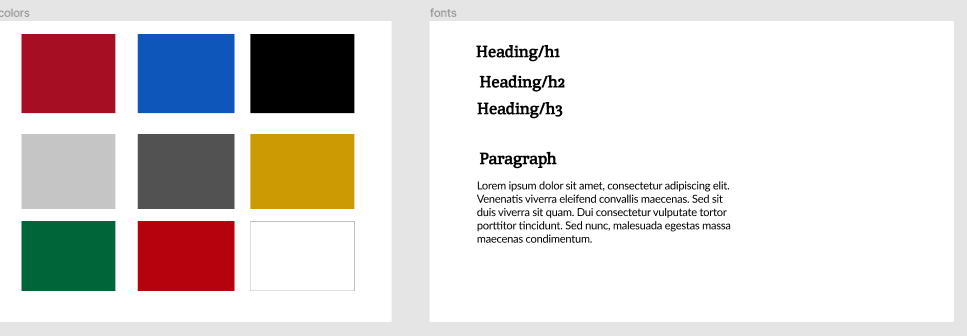
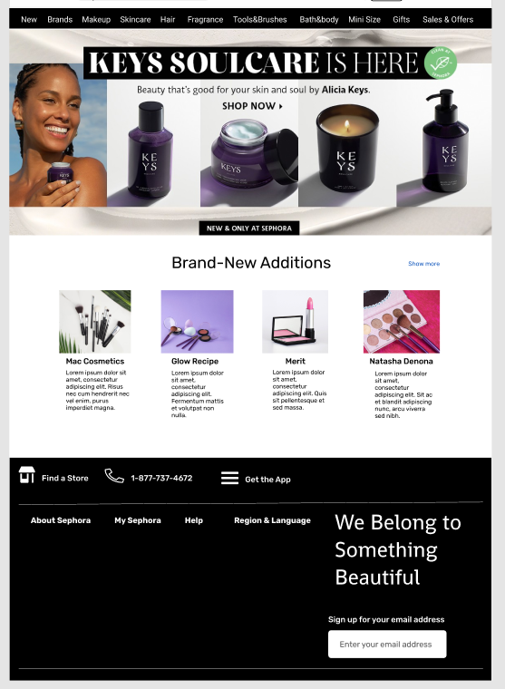

# dsgn270-a4

## Maryam Khan

### Figma Mockup

- [GH repo](https://github.com/maryambkhan/dsgn270-a4)

### Code Journal

- I am working on `sephora's` website for mockup. I choose there website becouse they have 
   lots going on on there site it would be good for prototype assignment.
- I created a library where i set colors and fonts, I found colors from there site and set them as style
   but i couldint fint any font they are using so i just found somthing similar.

    

- Now i am going to start working on designing the site.
- I have completed 2 nav bars (local and global) and i have put hero section image.
- It is looking good next i am working on product/card.
- I finished designing cards and already started working on footer.
- When i started working on footer i wanted to increase the length of card so i did that 
  when i scrolled up globel navigation was broken took me some time to fix it.
- I am almost done with footer and then my assignment will be done if no problem.

  
- I created the library from the style sephora had and did not even get to use those colors.
- Had little problem exporting design file then maha helped me i had wrong plugin added.

  ### Attributions

  - [Sephora](https://www.sephora.com/ca/en/)
  - [Pexel](https://www.pexels.com/search/cosmetics/)